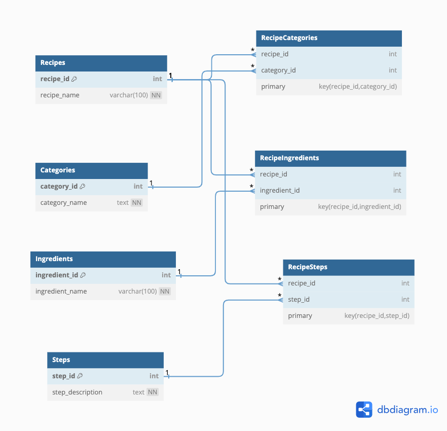

# Prep exercise week 3

As a preparation step for the upcoming Q&A, you need to work on the following exercise, which is based on the prep
exercise of the previous week.

## Exercise

Last week you created an ERD for the database for storing food recipes.
How can you normalize your database based on what you learned this week?
In particular, try answering following questions and provide table definitions from the last week
and this week to explain the changes.

- Was your database already in 2NF / 3 NF?

The database is well-structured and it meets the requirements of 2NF, it is organized without any issues or partial dependencies. It could, as an improvement, depending on the desires or requirements of the project, be turned into 3NF but I didn't deem it necesary on this one particularly.

- What changes did you have to do to normalize your database?

No changes were made to the database.

## Discussion

- If you want to add thousands of recipes to your database, what challenges do you foresee?
- Try to write answers to these questions in text, provide queries and commands when necessary.
